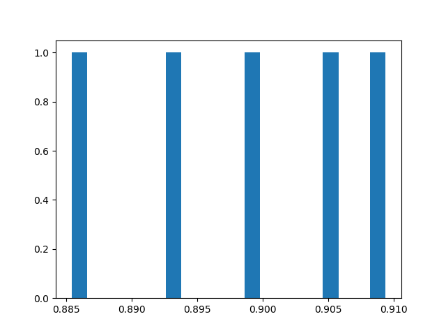

# recsys

Performance Analysis
==============================================

### Performance Table of All Models

The script `eval.py` can be used together with the `--compare` flag to create a table that shows the performance of all 
models tested (in a batch of jobs). For example:

`python eval.py --compare all --metric valid_mse --schema schemas/test.json --save figs/table_all.md`

will produce the following table:

| model   |   num_factors |   lr |   batch_size |   num_epochs |   train_loss |   train_mse |   valid_loss |   valid_mse |
|:--------|--------------:|-----:|-------------:|-------------:|-------------:|------------:|-------------:|------------:|
| fm      |             4 | 0.01 |          256 |            2 |       1.0207 |      1.0207 |       0.8957 |      0.8957 |
| fm      |             4 | 0.01 |          256 |            3 |       0.8935 |      0.8935 |       0.8373 |      0.8373 |
| mf      |             4 | 0.01 |          256 |            2 |       0.9241 |      0.9241 |       0.8854 |      0.8854 |
| mf      |             4 | 0.01 |          256 |            5 |       0.9241 |      0.9241 |       0.8855 |      0.8855 |

### Performance Table of Best Models

The `--compare` flag can also be used to create a table that only displays the performance of the best models. Simply
replace `all` with `best`. For example:

`python eval.py --compare best --metric valid_mse --schema schemas/test.json --save figs/table_best.md`

will produce:

| model   |   num_factors |   lr |   batch_size |   num_epochs |   train_loss |   train_mse |   valid_loss |   valid_mse |
|:--------|--------------:|-----:|-------------:|-------------:|-------------:|------------:|-------------:|------------:|
| fm      |             4 | 0.01 |          256 |            3 |       0.8935 |      0.8935 |       0.8373 |      0.8373 |
| mf      |             4 | 0.01 |          256 |            2 |       0.9241 |      0.9241 |       0.8854 |      0.8854 |

### Performance Histogram

The `eval.py` module together with the `--hist` flag can be used to visualize the performance of different
hyper-parameter combinations of a model. For example

`python eval.py --hist 20 --metric valid_mse --schema schemas/test_hist.json --save figs/test_hist.png`

produces the following figure:

